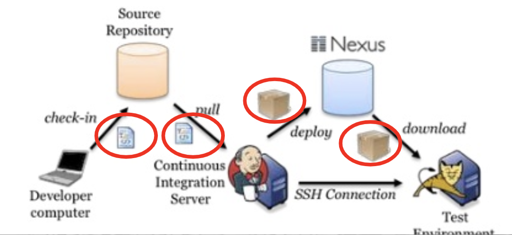
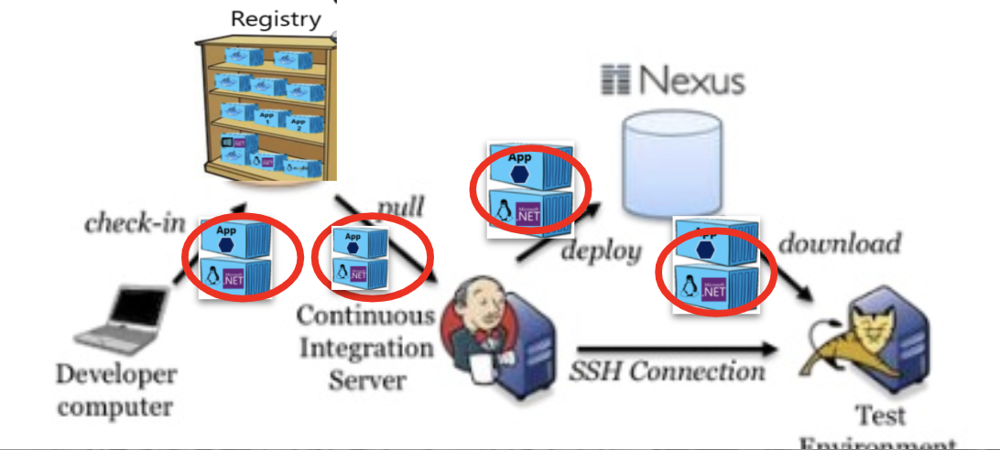
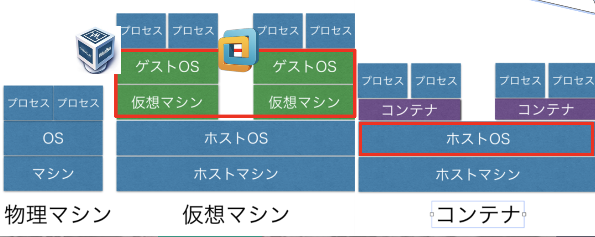
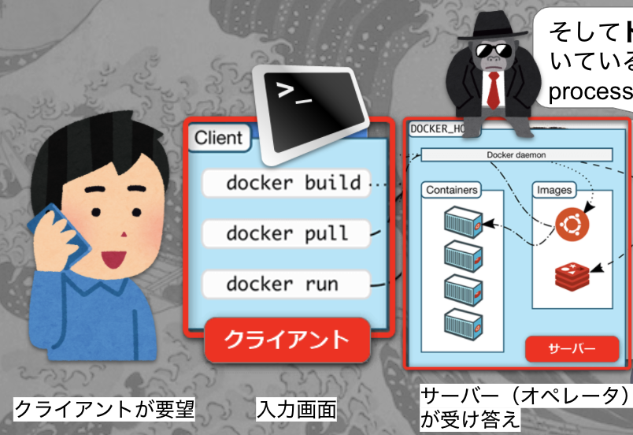

# 1. Intro

## 1. ドッカー？何それ美味しいの？ (What is Docker?) 

ドッカーは食べられません！
でもこの可愛いクジラさんは、エンジニア的にはかなりオイシイツールなんです

## 2. Why Docker?
- Dockerは毎年のように人気度が増えていて、2020年現在、インフラとDevelopmentを融和させるDevOpsという風潮の中では、なくてはならない存在です

## 3. Docker Benefits

__コードを速く正確にユーザに届けられるようになるからです__

BEFORE:
- 今まではDeveloperがコードを書いて、そのコードをインフラエンジニアに渡して、インフラが環境変数やライブラリーのインストールを本番環境でしていたんですね
- ただここで問題なのが、開発・テスト・本番環境が同一でないということなんですね
- つまりOSが違えばライブラリーのバイナリーも違い、「開発環境では動いてたのに本番では不動作が起きる」なんてよくあることなんですね。

AFTER:
- 開発チームがコードとライブラリーをパッケージングしてdocker imageを作り（__コンテナ化__）、運営チームにドッカーImageをそのまま渡すことで、ライブラリーやDependencyの食い違いを防げるんですね

__コンテナ化の例え__:
- 例えで言うと、引っ越しの時にダンボールで荷造りをすることで、業者が運びやすくなるのと似ています
- Dockerっていうのはコンテナという技術を使ってコードとライブラリーやパッケージをパッキングすることなんですね。

## 4. Pre-Container vs Post-Container Deployment Method

__Deployする最小単位のアーティファクトが、従来のファイル(.war, .jar, .py, .js)やフォルダー(.zip)から、コンテナ（コード＋パッケージ）に代わり、OS環境問わず同一の動作をする__

BEFORE:
- 今までは、ファイルやフォルダーをJenkinsなどのCICDパイプラインを使って、本番環境のサーバーにコピーしていました

AFTER:
- ドッカーでは、コードとライブラリーをパッケージングしてdocker imageを作り、本番環境のサーバーにドッカーイメージをダウンロードして、それを実行するだけでOKになります
- つまりDeployする最小単位のアーティファクトが、コンテナ（コード＋パッケージ）に代わり、OS環境問わず同一の動作をするんですね

## 5. VM (virttualization) vs Container 

BEFORE:
- 従来の仮想化は、1つのOS上に複数の仮想OSを置いて，そこでアプリケーションを動かしていました

AFTER:
- ただDockerの場合は、1つのOSにDocker engineを起動して複数のコンテナを起動します

More Container Benefits:
- リソースが軽い
    - OSを複数使わない分オーバーヘッド（複数のOSイメージとカーネル）が減り、プロセッサやメモリの消費が少なくなります
- ストレージの使用量が減る
    - OSイメージの通常サイズが５−１０GBに対し、Docker Imageのサイズは1−２GBなのでストレージの使用量も減ります。
- 起動時間が速い
    - カーネルをいちいちロードする手間が省け、仮想マシンに比べて起動時間が短くなります
- 複数環境での運営が楽
    - DockerがインストールされてるOSならどこでもコンテナが起動できます。

## 6. Docker Image vs Docker Container

__イメージとコンテナの違いは、例えで言うと、ClassとObject、車の設計図と実際の車、のようにテンプレートvs実物と言う違いです__

## 7. Docker Client vs Docker Daemon (Docker Client-Server Architecture)

プログラマーだとインフラ設計経験がない人もいると思うのでクライアント・サーバーと言われても「何それ？」ってなるかもしれません

__クライアント・サーバーアーチテクチャの例え__:
- 簡単な例えだと、カスタマーサポートチャットがいい例だと思います

ドッカーも似たように、入力画面とコマンドラインがクライアント、実際にコンテナを装備するのがサーバーです

そしてドッカーデーモンとは、裏方で動いているプロセスなのでDaemon processとかAgentとか言われます。

## 8. Install Docker (in 2020)

Docker Desktop for Mac : 
https://docs.docker.com/docker-for-mac/install/

Docker Desktop for Windows: 
https://docs.docker.com/docker-for-windows/install/

Linux:
https://docs.docker.com/engine/install/

## 9. Browser-based Docker playground

[Docker Playground](https://labs.play-with-docker.com/)
[Katacoda](https://www.katacoda.com/courses/docker/playground)

---
NEXT > [2. Intro to Basic Linux Commands and Concepts](../2_Linux_Basics/README.md) 