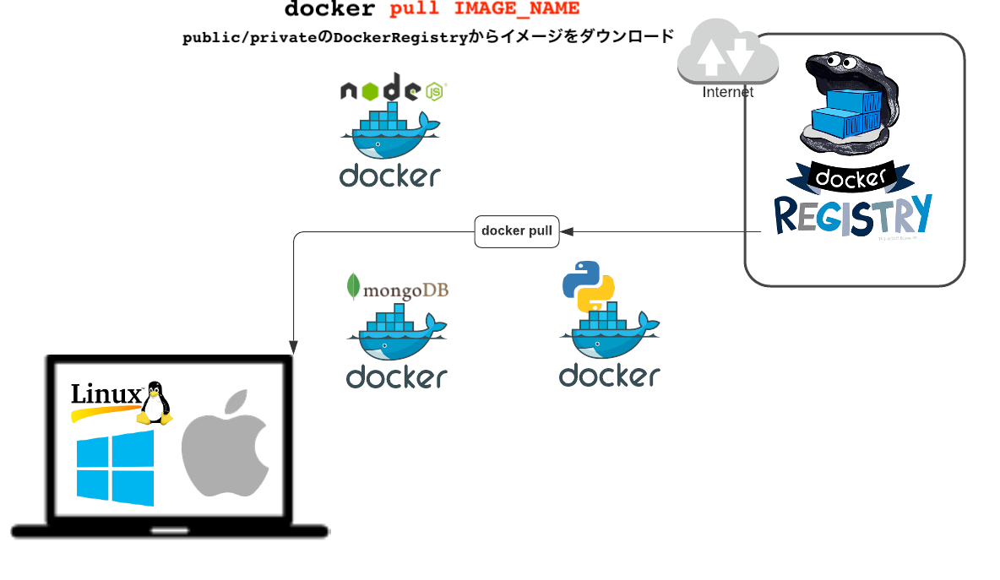
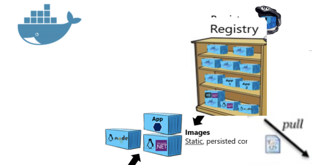
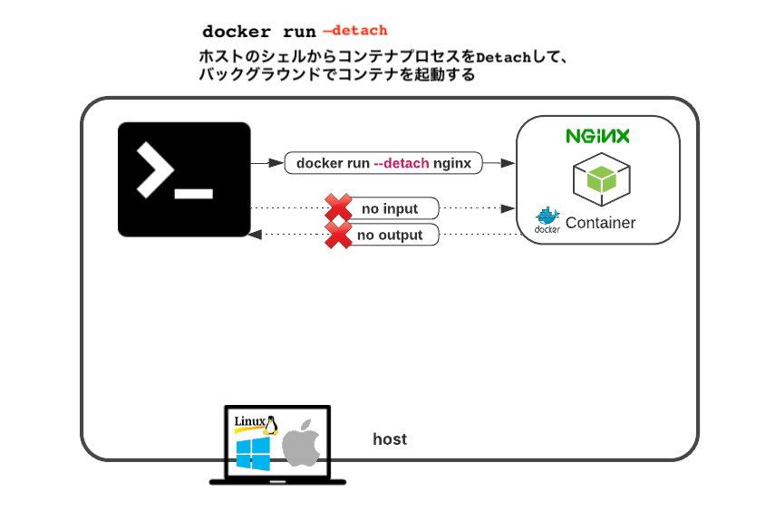
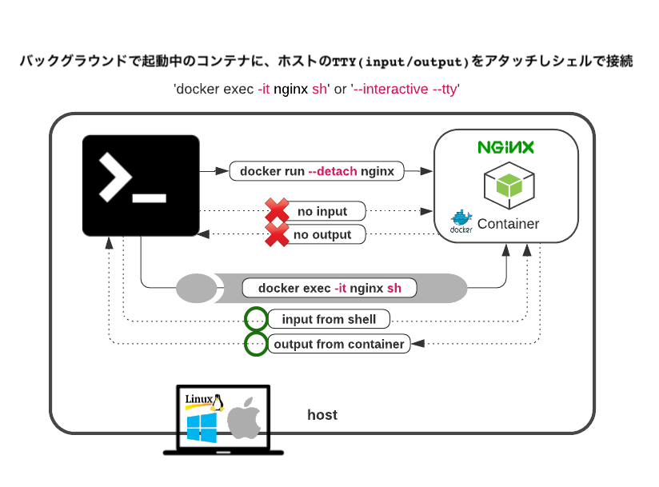
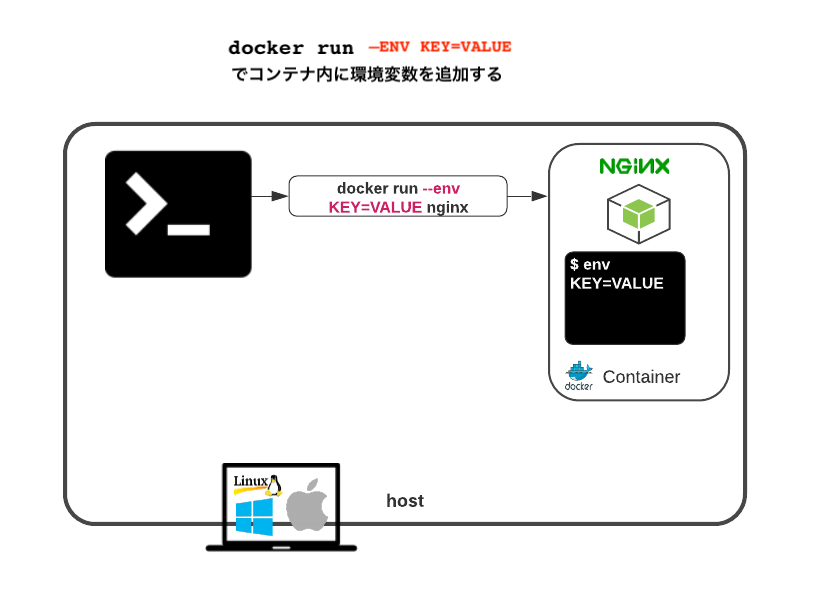
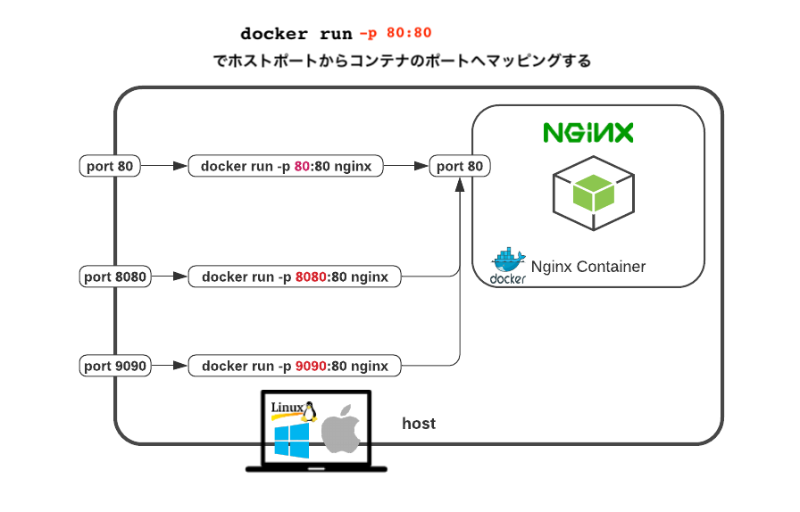
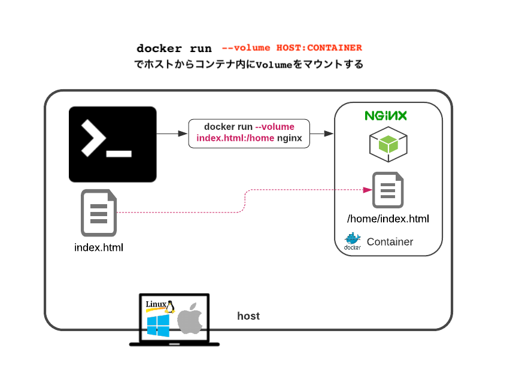
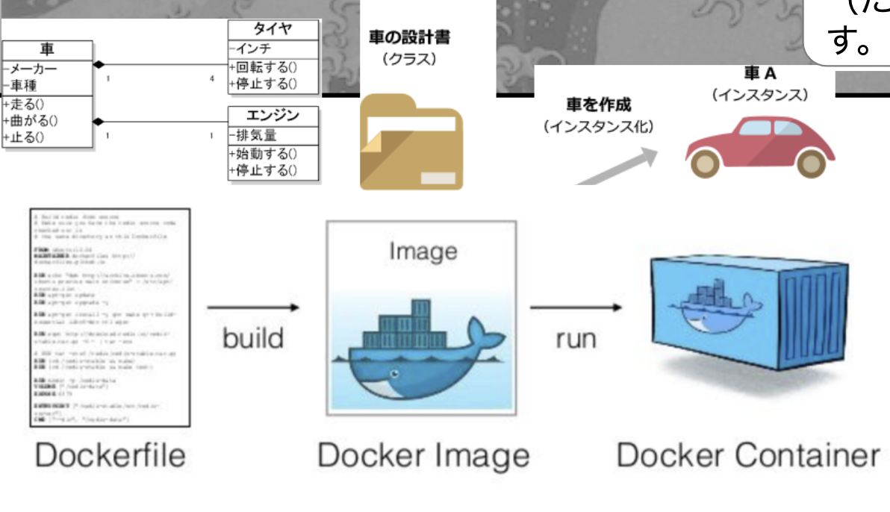

# 3. Hello Worldでドッカーの一連作業のフローを理解しよう (Docker Basics with Hello World)

## 3.1 Nginxドッカーイメージを取得 (Get Docker Image)



- ドッカーイメージを取得 (Pull)
```
docker pull nginx
```
- ドッカーイメージを表示 (List)
```
docker images
```
- ドッカーイメージの履歴を表示 (History)
```
docker history nginx
```
- ドッカーイメージを削除 (Delete Docker Image)
```
docker rmi nginx

docker images
```



## 3.2 nginxサーバーのコンテナを起動 (Start Docker Container from Image)

それではドッカーを使って、Hello Worldをサーバーから表示させてみましょう


- nginxサーバーのコンテナを起動 (Run)
```
$ docker run -p 80:80 --name nginx nginx
```
- 作動中のコンテナ一覧を表示 (List)
```
docker ps

# 停止中のコンテナも全て一覧表示
docker ps --all
```
- コンテナのログを表示 (Log)
```
docker logs nginx
```
- コンテナのメタデータを見てみる (Inspect Docker container)
```
docker inspect nginx
```
- Stop
```
docker stop nginx
```
- 停まったコンテナを削除 (Remove)
```
docker rm nginx
```
- コンテナをバックグラウンドで起動 `--detach`
 (Start container in background)

```
docker run --detach -p 80:80 --name nginx nginx
```
- 作動中のコンテナの中にシェルで入る (Exec) `exec -it`

```
docker exec -it nginx sh

exit
docker stop nginx
docker rm nginx
```
- コンテナの環境変数を設定する `--env TEST_ENV=hellow_world`

```
docker run --env TEST_ENV=hellow_world -d --name nginx nginx

docker exec -it nginx env
docker stop nginx
docker rm nginx
```
- コンテナに繋げるホスト側のポートを変える `-p 8080:80`

```
docker run -p 8080:80 -d --name nginx nginx

curl localhost:8080
```
- NginxのConfigファイルを見つける
```
docker exec -it nginx sh

find / -type d -name nginx | xargs grep -r  html
```
- デフォルトのHTMLファイルを表示する
```
cat /usr/share/nginx/html/index.html
```
- デフォルトのHTMLファイルを”Hello World"へ上書き
```
echo "Hello World" > /usr/share/nginx/html/index.html

exit
curl localhost:8080
docker stop nginx
docker rm nginx
```
- コンテナにホストからファイルをコピー (attach volume) `--volume "$(pwd)":/usr/share/nginx/html`

```
touch index.html && echo “hello world” > index.html

docker run -d --volume "$(pwd)":/usr/share/nginx/html -p 80:80 --rm --name nginx nginx

curl localhost:80
```

## 3.3 ついにMyドッカーイメージ作成 (Build Docker image)

実は起動したコンテナからも１コマンドでイメージ作れてしまいます。

- 起動中のコンテナからHello Worldイメージ作成 (commit)
```sh
docker commit nginx hello_world
docker stop nginx

docker images

# Hello Worldイメージからコンテナ起動して確認
docker run -d -p 80:80 --name hello_world hello_world

curl localhost:80

# Hello Worldが返ってこない理由は、Docker　Volumeでマウントされたファイルはコンテナ内に保存されないから

docker run  -p 80:80 --rm --name nginx -d  nginx 

docker exec -it nginx sh
echo "hello from container" > /usr/share/nginx/html/index.html
exit

curl localhost:80

# imageを作成
docker commit nginx hello_world

# Imageからコンテナ起動
docker run -p 8080:80 --rm -d --name hello_world hello_world

curl localhost:8080
# hello worldが返ってくる
```

他にも、リポからダウンロードできるイメージにえり好みの素材(パッケージ等)を<strong>Dockerfile</strong>に加えてMyイメージも作れます

ここで<strong>Dockerfile</strong>って何って思ったかもしれません。DockerfileはUMLダイアグラムみたいなもので（Classデザイン）、ドッカーイメージがクラス、コンテナがオブジェクトみたいなものです。

つまり、Dockerfileは<strong>ドッカーイメージ（たい焼き機）を作るレシピ（設計書）</strong>です。




__Dockerfileでレシピの作成__
```sh
# Dockerfileを作成
touch Dockerfile
```
```sh
＃　Dockerfileにマルチラインテクストを保存

cat > Dockerfile <<EOF
# FROMでイメージを指定
FROM nginx:latest 

WORKDIR /usr/share/nginx/html

# COPYでホストからファイルをイメージにコピー
COPY index.html index.html 

# RUNでシェルコマンドを実行
RUN apt update && apt install -y curl

# 他にもWORKDIR,ENV,CMDなど変数があります
EOF
```

実はドッカーイメージは、このDockerfileの各ラインが追加されるごとに、薄いReadOnlyイメージレイヤーを追加しているんですね.例えで言うと、玉ねぎの層が増す感じです


その証拠に、docker buildコマンドのアウトプットで、各コマンドステップで新たなコンテナイメージ層が作られているのが確認できます

- Dockerfileからイメージ作成 (build)
```
docker build --tag dockerfile_hello .

# 自作イメージからコンテナを起動
$ docker run -d -p 9090:80 --name hello_v2 dockerfile_hello

curl localhost:9090
```

イメージレイヤーはDockerfileで指定したコマンドと一致しています. つまり、Dockerfileの１コマンドごとにReadOnlyイメージレイヤーが上乗せされていくんです.

- ドッカーイメージの履歴を表示 (History)
```
docker history dockerfile_hello
```


## 3.4 自作イメージをリポで公開

ドッカーイメージを作ったら、あとはタグ付けをして、DockerHubなどのコンテナレジストリーにプッシュをします

まずはDockerhubの無料アカウント作成：　https://hub.docker.com/signup


- 作成したイメージをタグ付けする（ユーザーネーム/リポ名）
```
docker tag dockerfile_hello cscareerkaizen/dockerfile_hello_world_nginx
```
- Docker Hubにログイン
```
docker login
```
- DockerHubの自分のリポにイメージをアップロード
```
docker push cscareerkaizen/dockerfile_hello_world_nginx
```


## コンテナ・イメージのクリーンアップ

- 停止中のコンテナと無名のイメージを削除
```
docker system prune
```
- 起動中のコンテナ含め全コンテナを削除(注意)
```
docker rm -vf $(docker ps -a -q)
```
- 全てのイメージを削除(注意)
```
docker rmi -f $(docker images -a -q)
```

---
NEXT > [4_Multi_Containers_with_docker_compose](../4_Multi_Containers_with_docker_compose/README.md)