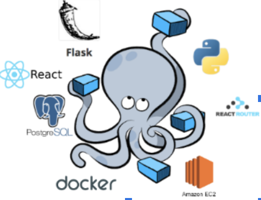
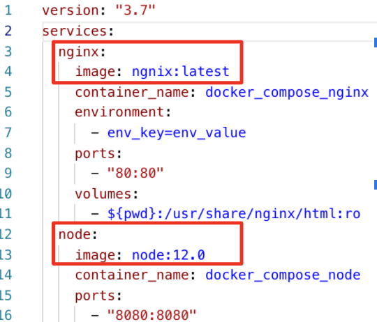
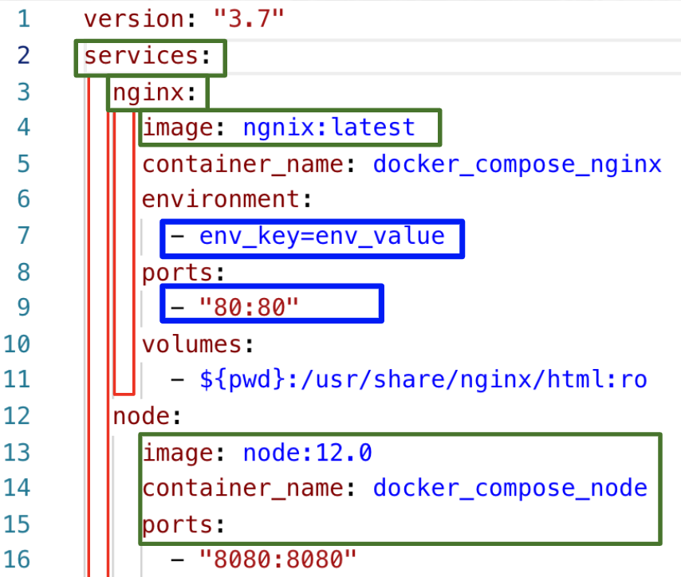
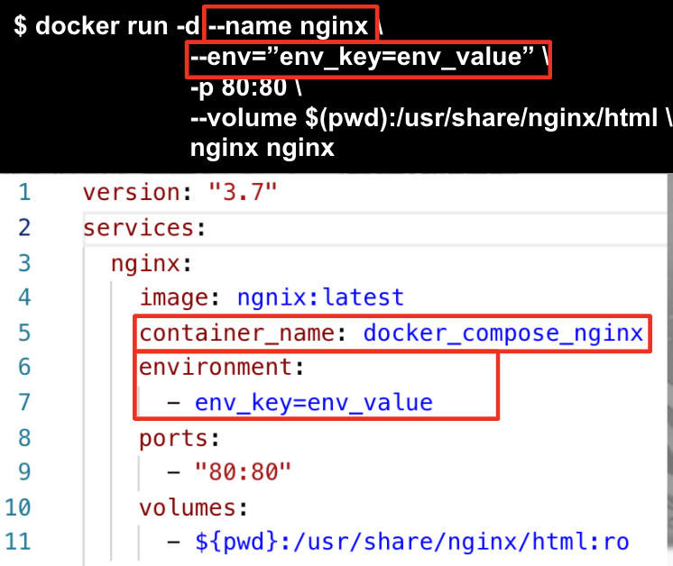
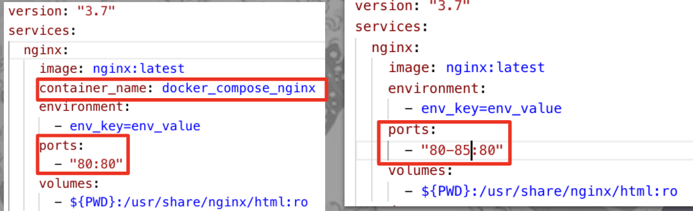

# 4. 複数のコンテナで手が回らない？docker-composeが解決！ (Manage multiple containers with docker-compose)

そこでDocker-composeが登場です。N個コンテナがあったら、N回`docker run`コマンド打つのはめんどくさいですよね



Docker-composeはYAML形式のファイルで、複数のコンテナを一括管理ができます。例えで言うと、手が２本から８本に増えた感じです




## 4.1 docker-compose manifest file anatomy

### YAMLって何？
YAMLファイルは<strong>インデントで区切りをつける</strong>JSONの兄弟で、セミコロンでなくインデントを使うPythonに似てます

そして<strong>トップダウンのヒエラルキー</strong>になっていて、services→Nginx→imageというレベルで表現されます

さらに、YAMLは基本<strong>Key-Valueペアのマップ</strong>になっていて、- “80:80”のように”-”で始まるものだけリストになってます




### Docker runからDocker-Composeへ
さらに、Docker runコマンドをDocker-composeに変換することができます

オプションである`--name`, `--env`,  `-p`, `--volume`はそれぞれYAMLでもマッピングされてます




## 4.2 docker-composeで複数コンテナを起動しよう

YAMLができたらあとはdocker-compose CLIを使って起動・停止します

- docker-composeのYAMLに定義されたサービスを起動する
```
docker-compose -f docker-compose.yaml up

docker ps
```
- 複数コンテナのログをまとめてみる
```
docker-compose -f docker-compose.yaml logs -f
```
- docker-composeのYAMLに定義されたサービスを停止
```
docker-compose -f docker-compose.yaml down
```

## 4.3 Docker-composeでコンテナを大量生産してみよう
他にも、docker-composeで各コンテナのレプリカを複数起動できたりします。


まずContainerNameを除き、ホスト側のポートをレンジに変更 (重複を避けるため)



- upコマンドに--scaleオプションでレプリカ数を指定
```
docker-compose -f docker-compose.replicas.yaml up --scale nginx=3
```


## 4.4 Inspect docker network

実は、Docker-composeで定義されたコンテナ同士で連絡取れるようになっています

ただYAMLの外でコンテナを起動すると、NGINXコンテナに繋がりません

- docker_compose_ubuntuコンテナに入って、NginxにCurlしてみる
```
docker exec -it docker_compose_ubuntu sh
apt update && apt install -y curl

curl docker_compose_nginx:80
Hello World
```
- UbuntuコンテナをDocker runで起動してCurlをインストール
```
docker run --name test -it --rm curlimages/curl:7.68.0 sh

curl docker_compose_nginx:80
curl:(6) Could not resolve host:
docker_compose_nginx
```


ということで、Dockerの一番の山場、ネットワーキングを次に学びましょう

---
NEXT > [5_Docker_Networking](../5_Docker_Networking/README.md)