# 5. Docker Networking

## 5.1 Network Namespace
実はコンテナが起動する時、裏ではネットワークネームスペース（個室）が作られそこにコンテナが割り当てられます

ネームスペースとは隔離する個室みたいなものです。家の中にもそれぞれ個室があるように、ネットワークの中も仕切りを作れます

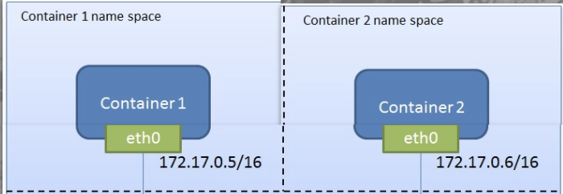


通常, 違うNetwork Namespace同士は会話できませんが、DockerはデフォルトでBridgeネットワークを作り個々を繋げています

この緑のdocker0がvirtual bridge networkで, vethxxxがネットワークlink, eth0がコンテナのnetworkです。

最後に、ネットワークネームスペースが共通のBridgeネットワークに繋がったら(緑)、172.17.x.x のIPを配布して接続可能となります

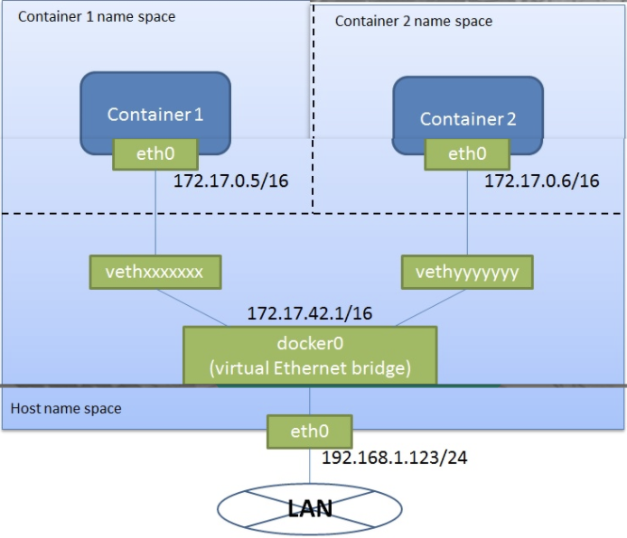

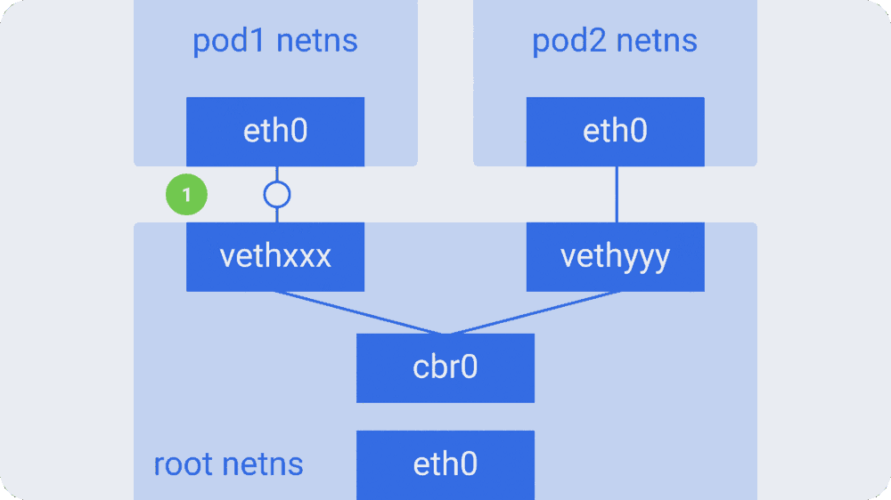


しかし、Docker-composeで起動したコンテナは新しいBridgeネットワーク`downloads_default`の中に作られ、デフォルトBridgeネットワークの中のコンテナとは接続が取れないのです

```
docker-compose up
```
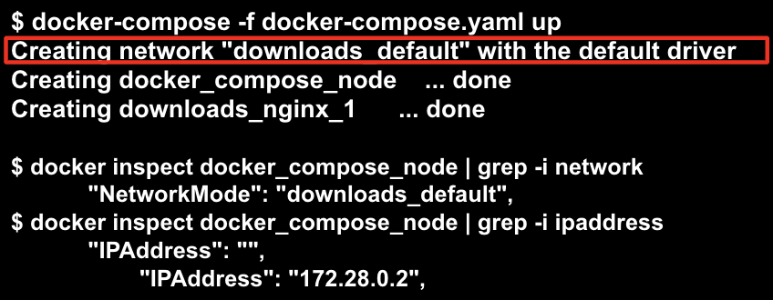


その証拠に、dockerネットワークを表示すると新しいBridgeネットワーク`downloads_default`が見えるし、docker run -d ubuntuで起動してそのネットワークをみるとデフォルトになっています

```
docker network ls

docker run --rm -it --name test curlimages/curl:7.68.0 sh
curl docker_compose_nginx:80
```

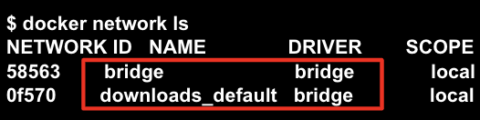


さらに、ComposeとRunコマンドで起動されたコンテナをインスペクトすると、ネットワークもIPレンジも違うことがわかります。

```
docker inspect docker_compose_nginx | grep -i network
docker inspect docker_compose_nginx | grep -i ipaddress

docker inspect test | grep -i network
docker inspect test | grep -i ipaddress
```

docker compose's CIDR `172.28.0.2`
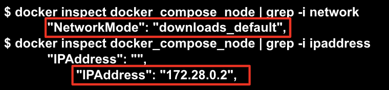

docker run's CIDR `172.17.0.2`
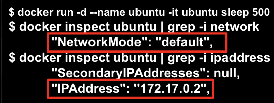


## 5.2 Dockerネットワークを確認する
ちなみに、Docker networkには4つモードがあって、デフォルトのBridge、host、null、overlayがあります

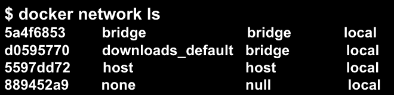

- ネットワークを表示する
```
docker network ls
```
- ネットワークを--driverオプションで作成する
```
docker network create --driver bridge custom_bridge
```
- ネットワークを削除する
```
docker network rm custom_bridge
```

### 5.2.1 None network
Noneモードの場合、コンテナはBridgeにもHostネットワークにもリンクされずIPもないので、接続不可の無人島状態になります。

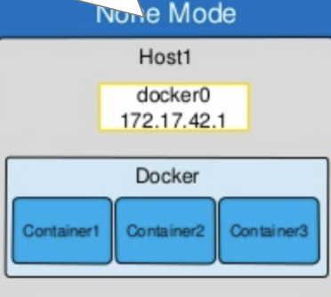
```
docker run --network=none --rm -d --name none -p 80:80 nginx
docker inspect none

curl localhost:80
```

### 5.2.2 Bridge network (default)
Bridgeモードの場合、ホストの中のDockerBridgeネットワークからIPが振り分けられるので、IPレンジがホストと異なります

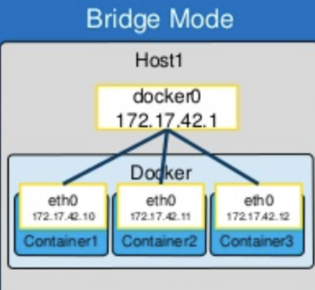

```
docker run --rm -d --name bridge -p 81:80 nginx
docker inspect bridge

curl localhost:81
```

### 5.2.3 Host network
Hostモードの場合、ホストのIPレンジからIPが振り分けら、ホストポートを使うので

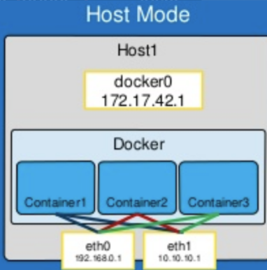

```
docker run --network=host --rm -d --name host  -p 82:80 nginx
docker inspect host

# for Mac, it doesn't work
# ref: https://forums.docker.com/t/should-docker-run-net-host-work/14215
curl localhost:81
```

### 5.2.4 Overlay network (multi-host environment)
最後のOverlayモードは、複数ホストがあるときに使います。Docker SwarmやKubernetesが複数ホストのケースです。

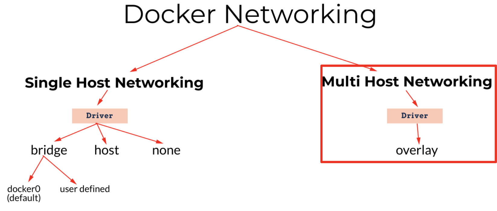


---
NEXT > [6_Docker_Storage](../6_Docker_Storage/README.md)