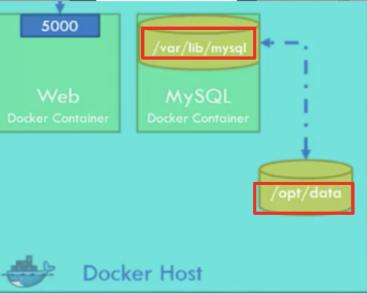

# 6. Docker Volumeのマウントとは (Docker Storage)

はい、コンテナは蛍の光のように儚いライフサイクルなので、データはコンテナ内ではなくホスト上に保存します。



Docker runコマンドで
`--volume /opt/datadir:/var/lib/mysql`のようにホスト上のフォルダーとコンテナ内のフォルダーを指定して、Volumeをマウントします

その証拠に、Docker runでVolumeをマウントしてコンテナ内に入り、ファイルを作ると、ホスト上にファイルが保存されてるのがわかります


## 6.1 Mount volume from host to docker container

- Docker runコマンドで--volumeでマウントしてUbuntuコンテナ内に入り、ファイルを作成
```
docker run -d -v $(pwd):/home --name test --rm -it busybox sleep 500

#コンテナに入る
docker exec -it test sh 

cd home && ls 
touch from_container.txt

#コンテナから出る
exit 　

#ホスト上のファイル表示
ls　　
from_container.txt
```


## クリーンアップ
```
docker rm -f test
```


---
NEXT > [7_Multi_host_Docker_with_Orchestration_Tools](../7_Multi_host_Docker_with_Orchestration_Tools/README.md)