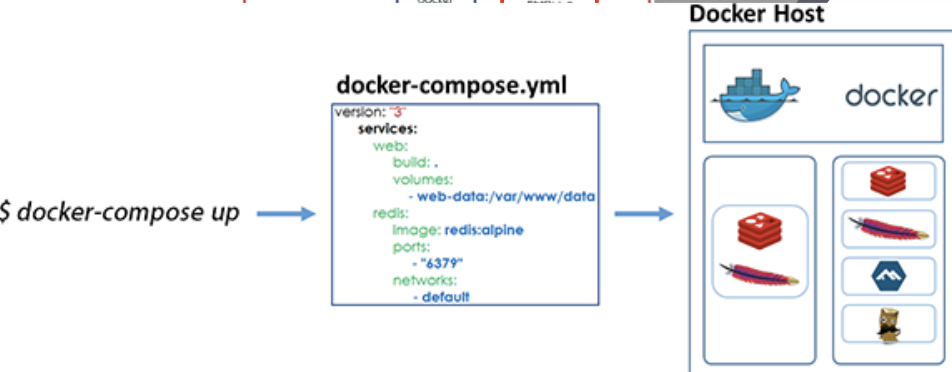
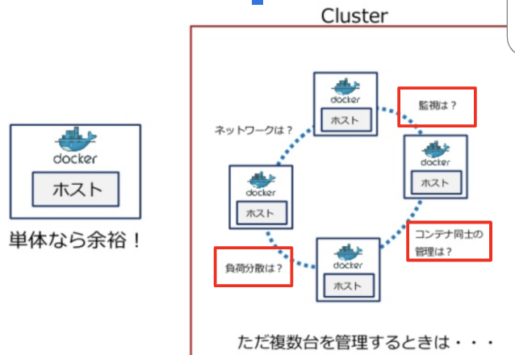
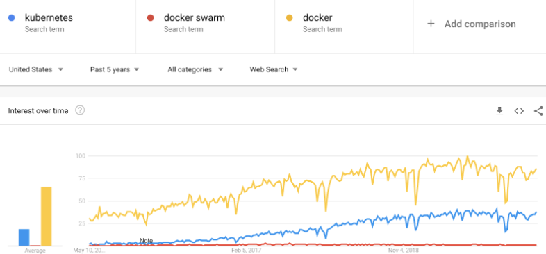
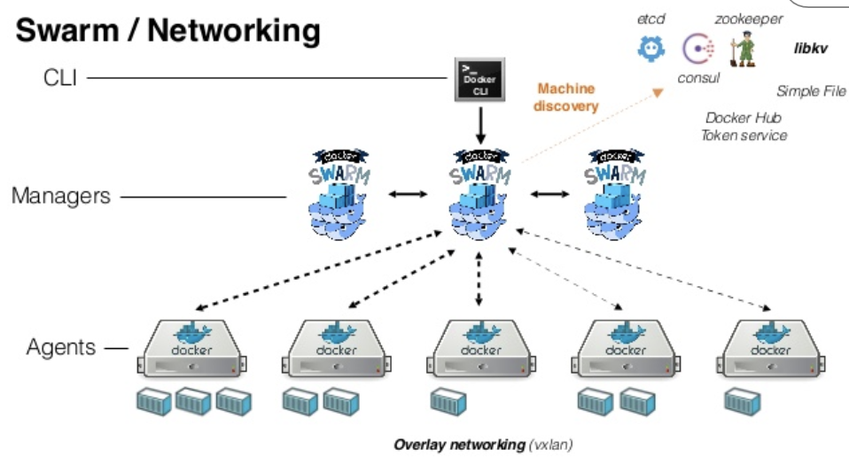
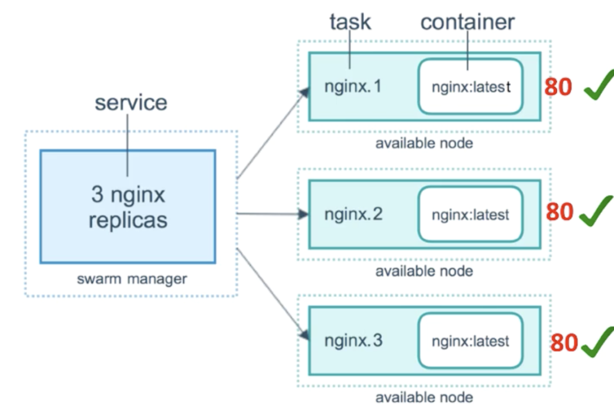
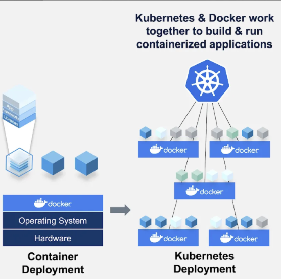

# 7. コンテナオーケストレーションとは？ (Container Orchestration tools  for multi-host production environment)

スワームとかクーバネティスって何？

変なカタカナ語だと思うかもしれませんが、どちらも群とかクラスターという意味があります

docker run vs docker-composeの違いは<strong>同一ホスト</strong>上での<strong>複数コンテナ</strong>管理かどうか学びましたよね




ただこの弱点は、いくら複数コンテナがあっても、唯一のホストが故障したらコンテナも消滅してしまいます


じゃあ、ホストを大量生産して複数コンテナを<strong>複数ホスト</strong>に振り分けようというのがContainer Orchestrationなんです


なぜSwarmやKubernetesを使うかというと、自前で複数ホストと複数コンテナを管理するのが難しいからです



例えば、ホスト間でのロードバランシング、モニタリング、コンテナ同士のネットワーキングなどです





## 7.1 Docker Swarm
では簡単にDocker Swarmでコンテナを起動、スケールアップ、ローリングアップデートをしてみましょう



- Docker SwarmをInitする
```
＃SwarmのStatusをチェック
docker info　

docker swarm init

＃SwarmのNodeをリストアップ
docker node ls　
```
- Docker SwarmのServiceを起動

```
docker service create --name helloworld alpine:3.10 ping docker.com

docker service ls

docker service inspect --pretty helloworld
```
- Docker SwarmのServiceをスケールアップ
```
docker service scale helloworld=3

docker service rm helloworld
```
- Serviceをローリングアップデート
```
docker service update --image alpine:3.11 helloworld

#ローリングアップデートを表示
docker service ps helloworld  
```

## 7.2 Kubernetes (top industry choise)
では簡単にKubernetesのMinikube(1つだけのNode)でコンテナを起動、スケールアップ、ローリングアップデートをしてみましょう



- まずはMinikubeとkubectlをインストール
```
＃BrewコマンドはMacのみ
brew install minikube　

brew install kubectl
```
- Minikubeを起動
```
minikube start
minikube status
```
- コンテナを1つ起動し、3つにスケールアップ
```
#まずはコンテナを1つ起動
kubectl run helloworld --image alpine:3.10 --command -- ping docker.com 

＃Deploymentをリストアップ
kubectl get deployment　

＃3つにスケールアップ
kubectl scale --replicas=3 deploy/helloworld　
```
- Deploymentをローリングアップデート、ロールバック
```
kubectl set image deploy/helloworld helloworld=alpine:3.11

＃履歴チェック
kubectl rollout history deploy/helloworld　

# ロールバック
kubectl rollout undo deploy/helloworld  

＃クリーンアップ
kubectl delete deploy helloworld && minikube delete　
```


---
NEXT > [8_Real_World_Docker_Best_Practices](../8_Real_World_Docker_Best_Practices/README.md)